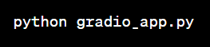

## 🚀User-Friendly Web Interaction for Machine Learning Ventures using Streamlit 🤖 🚀 🚀

This endeavor showcases the integration of a machine learning model within a graphical user interface (GUI) using Streamlit. The objective is to fashion an engaging interface for sales forecasting accessible to consumers and stakeholders via Streamlit.This application was developed in conjunction with the Azubi Africa Data Science Training program.

## Prerequisites

Make sure you have the following libraries installed in your Python environment or virtual environment:

* Streamlit
* pandas
* xgboost

You can install these libraries using the following command:

## Setup 💻 🪛 🔧

To set up and run the Streamlit app in your local environment, follow these instructions:

1. Clone this repository to your local machine:

2. Create and activate a virtual environment (optional but recommended):

3. Install the required libraries using pip:

NB: Run the demo app using the following command:

The app will be launched in your default web browser. You can then interact with the interface to make sales predictions based on the input fields.

## Preview 🔍 🤖

## Authors 📖 🧑‍🎓

This project was developed during the Azubi Africa Data Science Training. Below is the details of the initial collaborators of this project with respective articles covering the process of the project and their individual github profiles.

| Name                | Article | Github |
| ------------------- | ------- | ------ |
| Isaac Sarpong       |         |        |
| Israel Anaba Ayamga |         |        |
| Peter Mutiwri       |         |        |
| Emmanuel Morkeh     |         |        |

## Features

**Sales Prediction**: The app allows users to input the date, store number, and product family to get a sales prediction using a pre-trained XGBoost model.

**Interactive Interface**: Streamlit provides an easy-to-use, web-based interface for users to interact with the model and get predictions.

## Model Training and Saving 🤖

The XGBoost model was trained using data from the corporate favoritas chain to stores and saved as "exported_data.pkl" using XGBoost version during model training.

## Usage Instructions 🧑‍🏫

Input Fields: The app displays input fields for the date, store number, and product family.
Prediction: Click the "Predict Sales" button to get a sales prediction based on the provided inputs.
Results: The app will display the predicted sales for the specified date, store number, and product family.

## Troubleshooting 🛠️

If you encounter any issues with the app, ensure that you have the required libraries installed and that the "exported_data.pkl" file is in the correct location.
Verify that the XGBoost version used for training matches the version used during deployment.

## License

This project is licensed under the [MIT License](LICENSE)

## Acknowledgments

Special thanks to Azubi Africa for providing the training and opportunity to work on this project.
